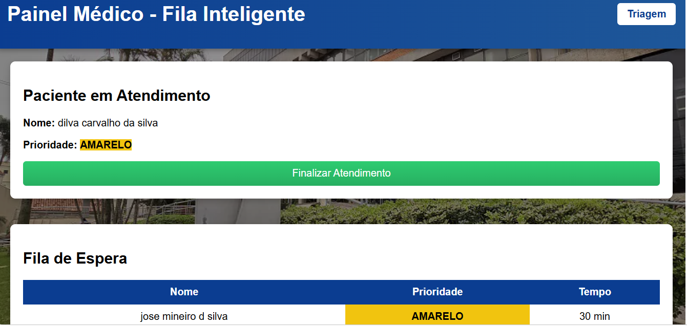
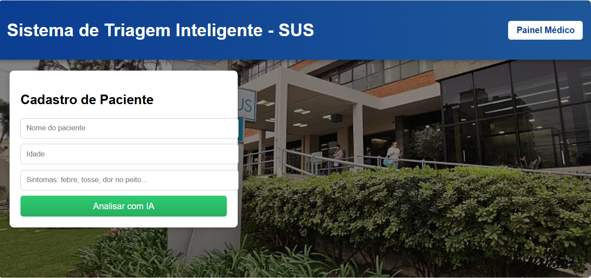

# sistema-triagem-sus
Sistema de Triagem Inteligente para o SUS utilizando Python, Flask e Machine Learning (Decision Tree) para classificação automática de prioridade e estimativa de tempo de atendimento.
##  Demonstração do Sistema

### Tela de Triagem

### Painel Médico
git add .

##  Tecnologias Utilizadas

- **Linguagem:** Python 3
- **Framework Web:** Flask
- **Inteligência Artificial:** Scikit-Learn (`DecisionTreeClassifier` e `DecisionTreeRegressor`)
- **Banco de Dados:** SQLite3
- **Frontend:** HTML5, CSS3

---

##  Funcionalidades

- **Cadastro e Triagem:** Coleta de dados do paciente e sintomas.
- **Classificação por IA:** Classificação automática de prioridade por cores (**VERMELHO**, **AMARELO**, **VERDE**) e estimativa de tempo.
- **Painel Médico:** Fila de espera dinâmica em tempo real.

---

**Desenvolvido por Glebson Carlos da Silva**

